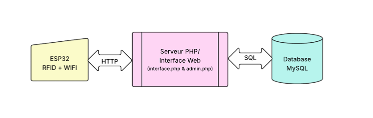
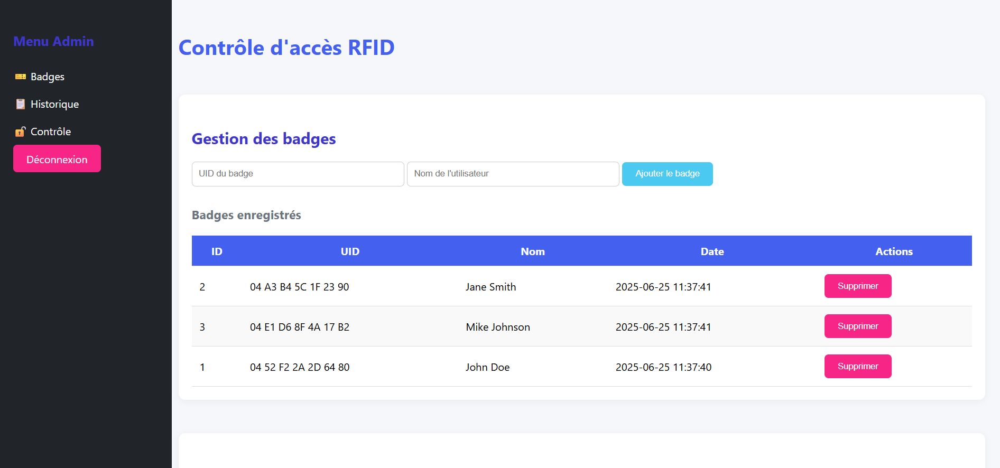

# Automated IoT Access Control System

## Project Overview
This project focuses on the design and implementation of a secure IoT-based access control system using ESP32, RC522 RFID module, and an electric lock. The system integrates hardware components with a PHP/MySQL web interface for managing RFID badges and monitoring access logs. The project was developed as part of the "Industrie 4.0 et Usine Future" course from April 2025 to June 2025. 
 
## Features 
- **Secure Access Control**: RFID-based authentication using ESP32 and RC522 module.
- **Web Interface**: PHP/MySQL-based dashboard for managing badges and viewing access logs.
- **Hardware Integration**: Relay control for electric lock and functional testing in a local XAMPP environment.
- **Real-Time Logging**: Logs access attempts and their statuses (GRANTED/DENIED).
 
## Materials Used
- **ESP32**: Microcontroller for WiFi connectivity and RFID processing.
- **RC522 RFID Module**: For reading RFID badges.
- **Relay Module**: To control the electric lock.
- **Electric Lock**: For physical access control.
- **12V Power Supply**: To power the lock and relay.
- **XAMPP**: Local server environment for PHP/MySQL.

## System Architecture
1. **RFID Badge Scanning**: The RC522 module scans the badge and sends the UID to the ESP32.
2. **Server Communication**: The ESP32 communicates with the PHP API hosted on a local XAMPP server.
3. **Access Decision**: The server checks the UID against the database and returns GRANTED or DENIED.
4. **Relay Control**: If access is granted, the relay activates the electric lock.
5. **Logging**: All access attempts are logged in the MySQL database.

### Hardware Wiring Diagram

This diagram illustrates the connections between the ESP32, RC522 RFID module, relay, and electric lock. It also includes the power supply setup for the system.

### System Workflow Diagram

This diagram provides an overview of the system's workflow, showing how the ESP32 communicates with the PHP server and MySQL database to manage access control.

## Web Interface
### Login Page

The login page allows administrators to authenticate and access the dashboard.

### Dashboard

The dashboard provides functionalities for:
- Adding and removing RFID badges.
- Viewing access logs.
- Manually controlling the door lock.

## Arduino Code Explanation
The `code-iot.ino` file contains the logic for:
- **WiFi Connection**: Connects the ESP32 to the local network.
- **RFID Scanning**: Reads the UID of RFID badges.
- **Server Communication**: Sends the UID to the PHP API and processes the response.
- **Relay Activation**: Activates the relay to unlock the door for a specified duration.

### Key Functions
- `setup()`: Initializes the RFID module, WiFi connection, and relay.
- `loop()`: Continuously scans for RFID badges and handles server communication.
- `activateRelay(duration)`: Activates the relay for the given duration.

## How to Run the Project
1. **Hardware Setup**:
   - Connect the RC522 RFID module and relay to the ESP32.
   - Wire the electric lock to the relay.
   - Power the system using a 12V power supply.

2. **Software Setup**:
   - Install XAMPP and start Apache and MySQL services.
   - Place the PHP files (`index.php`, `api.php`, `admin.php`) in the `htdocs` directory.
   - Import the MySQL database schema for `rfid_access`.

3. **Arduino Code**:
   - Upload the `code-iot.ino` file to the ESP32.
   - Update the WiFi credentials and server URL in the code.

4. **Testing**:
   - Scan RFID badges and monitor access logs via the web interface.
   - Test the relay and electric lock functionality.

## Conclusion
This project demonstrates the integration of IoT and industrial engineering concepts to create a functional and secure access control system. The combination of hardware and software ensures real-time monitoring and management of access attempts, making it suitable for various applications in smart buildings and industrial environments.
